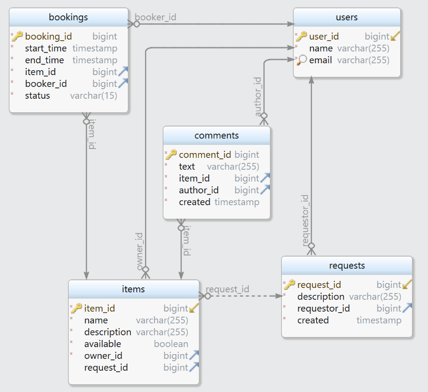

# ShareIt.
Проект — сервис краткосрочной аренды вещей consumer-to-consumer.  
Стек:  **Java 11, Spring Boot, Maven, PostgreSQL, Hibernate, Docker, REST,  JUnit,  Mockito.**

---
### EndPoints
#### UserController:
```POST /users``` - создание нового пользователя;  
```GET /users/{userId}``` - получение пользователя по его ID;  
```GET /users``` - получение списка всех пользователей;  
```PATCH /users/{userId}``` - обновление данных пользователя;  
```DELETE /users/{userId}``` - удаление пользователя по ID;

#### ItemController:
```POST /items``` - создание нового вещи;  
```PATCH /items/{itemId}``` - обновление данных вещи по его ID;  
```GET /items/{itemId}``` - получение вещи по её ID;  
```GET /items``` - получение списка всех вещей;  
```GET /items/search``` - поиск вещи пользователем по названию/описанию;  
```DELETE /items/{itemId}``` - удаление вещи по ID;  
```POST /items/{itemId}/comment``` - добавление комментария пользователем к вещи;

#### RequestController:
```POST /requests``` - создание запроса на добавление какой-либо вещи;  
```GET /requests/{requestId}``` - посмотреть запрос на добавление вещи по ID запроса;  
```GET /requests``` - получение списка сделанных пользователем запросов на добавление вещей;  
```GET /requests/all``` - получение списка всех запросов на добавление вещей, сделанных другими пользователями;

#### BookingController:
```POST /bookings``` - создание запроса на бронирование вещи;  
```PATCH /bookings/{bookingId}``` - одобрение/отклонение заявки на бронирование вещи;  
```GET /bookings/{bookingId}``` - получение заявки на бронирование по ID заявки;  
```GET /bookings``` - получение списка всех бронирований текущего пользователя;  
```GET /bookings/owner``` - получение списка бронирований для всех вещей текущего пользователя;

---

ER-диаграмма БД приложения:

